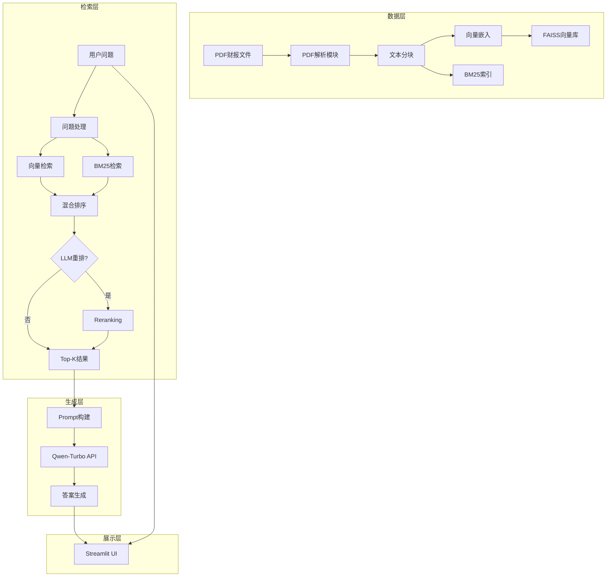
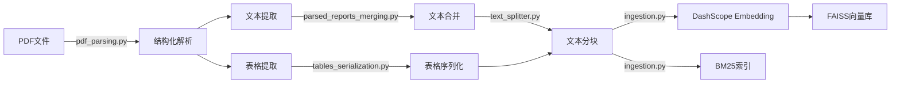
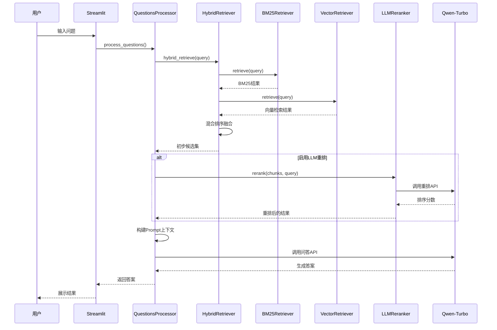
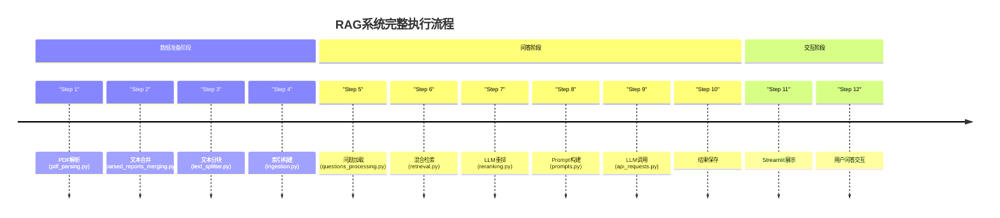

# RAG-cy 企业知识库系统

**Read more about this project:**
- Russian: https://habr.com/ru/articles/893356/
- English: https://abdullin.com/ilya/how-to-build-best-rag/

这是一个基于 Qwen-Turbo 的企业知识库 RAG 问答系统，用于分析和回答关于公司财报的问题。

## 项目架构



## 核心技术栈

| 分类 | 技术 |
|------|------|
| 语言 | Python |
| 大模型 | Qwen-Turbo (DashScope) |
| 向量数据库 | FAISS |
| 传统检索 | BM25 |
| PDF解析 | docling / Mineru |
| Web界面 | Streamlit |
| API支持 | OpenAI, DashScope |

## 处理流程

### 数据准备阶段



### 问答阶段



## 核心模块说明

### 文件结构

```
RAG-cy/
├── src/
│   ├── pipeline.py          # 主流程控制器
│   ├── pdf_parsing.py       # PDF解析（docling）
│   ├── pdf_mineru.py        # PDF解析（mineru）
│   ├── text_splitter.py     # 文本分块
│   ├── ingestion.py         # 索引构建（FAISS/BM25）
│   ├── retrieval.py         # 检索模块
│   ├── questions_processing.py  # 问答处理
│   ├── prompts.py           # 提示词模板
│   ├── reranking.py         # LLM重排
│   └── api_requests.py      # API请求
├── data/stock_data/
│   ├── pdf_reports/         # 原始PDF
│   ├── debug_data/          # 中间处理结果
│   └── databases/           # 索引存储
├── app_streamlit.py         # Web界面
└── main.py                  # 命令行入口
```

### 模块功能

1. **pdf_parsing.py** - 调用Docling工具对PDF年报进行结构化解析
2. **parsed_reports_merging.py** - 将PDF解析结果规整为结构化列表，可导出为markdown
3. **text_splitter.py** - 将报告文本按Token数分块，支持表格特殊处理
4. **ingestion.py** - 包含BM25索引和FAISS向量库构建
5. **retrieval.py** - 实现BM25、向量、混合等多种检索器
6. **questions_processing.py** - 问题处理与答案生成主逻辑
7. **reranking.py** - 基于LLM的检索结果重排序
8. **prompts.py** - 集中定义所有LLM提示词和结构化输出Schema
9. **api_requests.py** - 与各类大模型API交互的统一封装
10. **pipeline.py** - 系统主流程调度模块

## 执行流程



## 关键配置

```json
{
    "top_n_retrieval": 10,
    "llm_reranking": true,
    "llm_reranking_sample_size": 5,
    "parent_document_retrieval": false,
    "parallel_requests": 10,
    "api_provider": "dashscope",
    "answering_model": "qwen-turbo-latest"
}
```

> **注意**：Qwen-Turbo API限流为每分钟500次调用（QPM），每分钟Token消耗不超过500,000

## Quick Start

```bash
git clone https://github.com/liangxuru/RAG-cy.git
cd RAG-cy
pip install -r requirements.txt
```

重命名 `env` 为 `.env` 并添加你的 API keys。

### 运行 Streamlit 界面

```bash
streamlit run app_streamlit.py
```

### 运行命令行

```bash
# 获取帮助
python main.py --help

# 解析PDF
python main.py parse-pdfs

# 处理问题
python main.py process-questions --config max_nst_o3m
```

## License

MIT