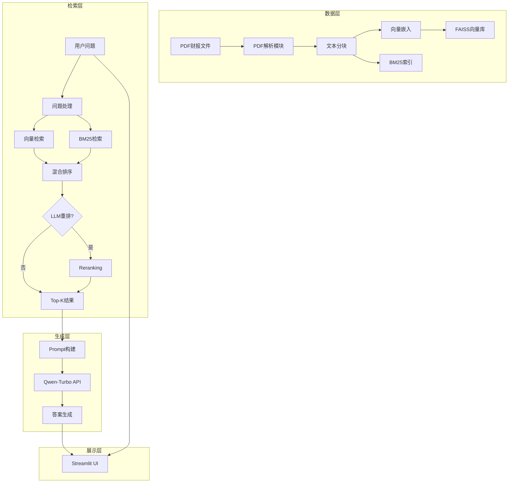
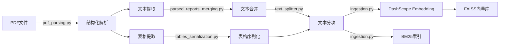
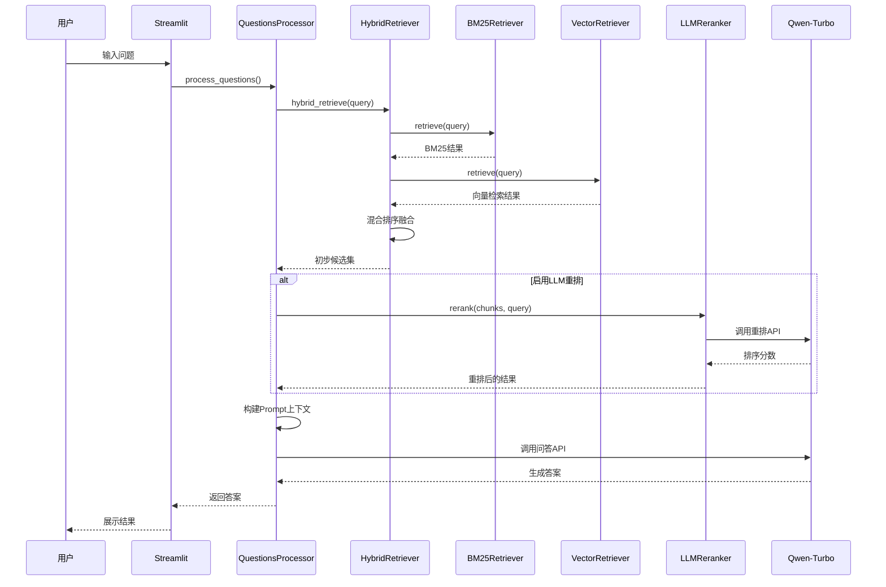
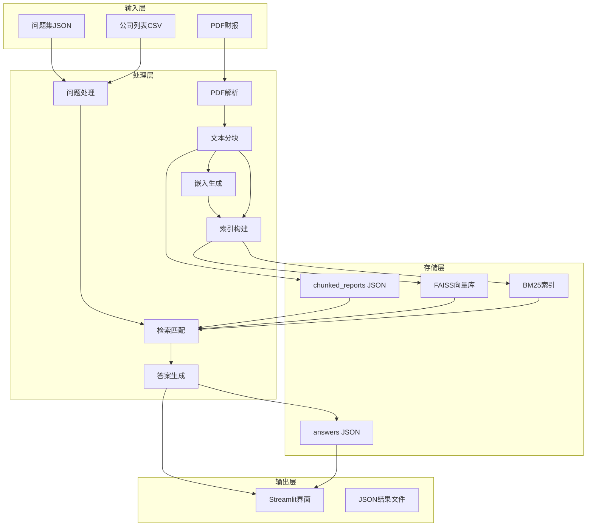
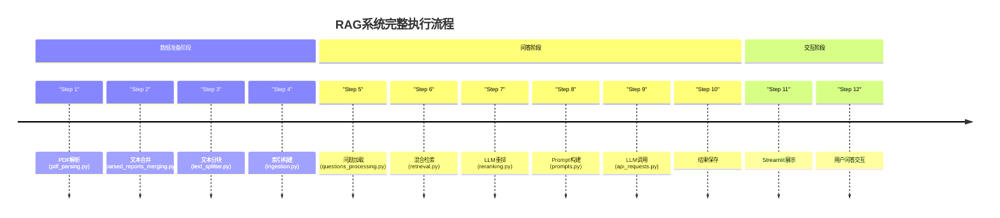

# RAG-cy 企业知识库系统 - 项目文档

> 企业知识库 RAG 系统 - 基于 Qwen-Turbo 的财报分析问答系统

---

## 目录

1. [项目架构概览](#项目架构概览)
2. [核心模块功能说明](#核心模块功能说明)
3. [数据处理流程](#数据处理流程)
4. [检索流程](#检索流程)
5. [技术栈](#技术栈)
6. [关键配置与参数](#关键配置与参数)
7. [数据流向图](#数据流向图)
8. [执行流程时序](#执行流程时序)

---

## 项目架构概览



---

## 核心模块功能说明

### 文件结构

```
RAG-cy/
├── src/
│   ├── pipeline.py          # 主流程控制器
│   ├── pdf_parsing.py       # PDF解析（docling）
│   ├── pdf_mineru.py        # PDF解析（mineru）
│   ├── text_splitter.py     # 文本分块
│   ├── ingestion.py         # 索引构建（FAISS/BM25）
│   ├── retrieval.py         # 检索模块
│   ├── questions_processing.py  # 问答处理
│   ├── prompts.py           # 提示词模板
│   ├── reranking.py         # LLM重排
│   └── api_requests.py      # API请求
├── data/stock_data/
│   ├── pdf_reports/         # 原始PDF
│   ├── debug_data/          # 中间处理结果
│   └── databases/           # 索引存储
├── app_streamlit.py         # Web界面
└── main.py                  # 命令行入口
```

### 各模块详细说明

#### 1. api_requests.py
主要负责与各类大模型API（如OpenAI、IBM、Gemini等）进行交互，统一封装了消息发送、结构化输出、重试、计费等逻辑。还包含异步处理和RAG上下文问答的接口，是整个系统与LLM交互的核心。

#### 2. api_request_parallel_processor.py
用于并发、限流地批量处理API请求，支持大规模任务的流式处理、重试、速率控制和日志记录。常用于批量嵌入生成或大规模LLM推理。

#### 3. ingestion.py
包含两大类：
- `BM25Ingestor`：负责将文本块构建为BM25索引，支持传统检索。
- `VectorDBIngestor`：负责将文本块转为向量并建立faiss向量库，支持语义检索。

#### 4. parsed_reports_merging.py
负责将复杂的PDF解析结果（JSON）进一步规整为每页文本的结构化列表，并可导出为markdown，便于后续分块、检索和人工审查。

#### 5. pdf_parsing.py
负责调用Docling等工具对PDF年报进行结构化解析，输出为标准JSON格式。支持并行处理、元数据补全、页码校正等，是数据流的起点。

#### 6. pipeline.py
系统主流程调度模块，串联PDF解析、表格序列化、报告规整、分块、向量化、问题处理等各阶段。可按不同配置灵活组合各处理环节。

#### 7. prompts.py
集中定义了所有LLM提示词（Prompt）和结构化输出Schema，涵盖问答、重排、表格序列化、比较等多种场景，保证LLM输出的规范性和可解析性。

#### 8. questions_processing.py
负责问题的处理与答案生成。包括公司名抽取、检索调用、RAG上下文构建、LLM问答、答案后处理、引用页校验等，是问答主逻辑的实现核心。

#### 9. reranking.py
实现了基于Jina API和LLM的检索结果重排序（Rerank），可结合向量分数和LLM相关性分数加权，提升检索结果的相关性。

#### 10. retrieval.py
实现了BM25、向量、混合等多种检索器，支持按公司名和问题检索相关文本块，并可选用LLM重排，作为RAG的检索环节。

#### 11. tables_serialization.py
负责将PDF解析出的表格内容，结合上下文，通过LLM序列化为结构化信息块，便于后续检索和问答。

#### 12. text_splitter.py
负责将规整后的报告文本按Token数进行分块，支持表格内容的特殊处理，生成适合向量化的文本块。

#### 13. __init__.py
空文件，用于标识src为Python包。

#### 14. dummy_report.pdf
示例PDF文件，用于测试和模型下载。

### 模块关系与整体流程

1. **PDF解析**：`pdf_parsing.py` → 结构化JSON
2. **表格序列化（可选）**：`tables_serialization.py`
3. **报告规整**：`parsed_reports_merging.py` → 规整为页文本
4. **文本分块**：`text_splitter.py`
5. **向量/检索库构建**：`ingestion.py`
6. **问题处理与RAG问答**：`questions_processing.py` + `retrieval.py` + `api_requests.py`
7. **检索重排**：`reranking.py`
8. **主流程调度**：`pipeline.py`

---

## 数据处理流程



> **关键技术点**：采用双检索策略（向量+BM25），提高召回率和准确性

---

## 检索流程



---

## 技术栈

| 分类 | 技术 |
|------|------|
| 语言 | Python |
| 大模型 | Qwen-Turbo (DashScope) |
| 向量数据库 | FAISS |
| 传统检索 | BM25 |
| PDF解析 | docling |
| Web界面 | Streamlit |
| API支持 | OpenAI, DashScope |

---

## 关键配置与参数

### 检索参数 (QuestionsProcessor)

```json
{
    "top_n_retrieval": 10,
    "llm_reranking": true,
    "llm_reranking_sample_size": 5,
    "parent_document_retrieval": false,
    "parallel_requests": 10,
    "api_provider": "dashscope",
    "answering_model": "qwen-turbo-latest"
}
```

> **注意**：Qwen-Turbo API限流为每分钟500次调用（QPM），每分钟Token消耗不超过500,000

---

## 数据流向图



---

## 执行流程时序



---

> 以上各环节可通过 `pipeline.py` 灵活组合，支撑多种RAG问答与数据分析场景。